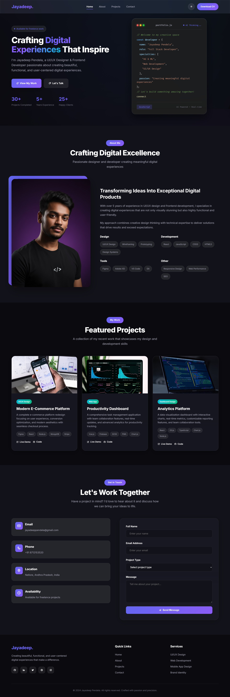
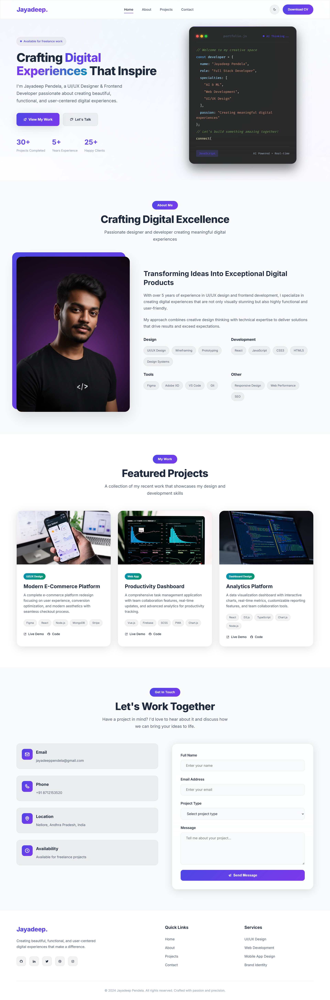

# Portfolio Website

A modern, responsive portfolio website built with HTML, CSS, and JavaScript.

## 🚀 Live Demo
**[View Live Site](https://jayadeep8712.github.io/My_Portfolio/)**

*Main portfolio interface showing dark theme*

## Features

- **Single HTML File** - Complete website in one file
- **Dark/Light Mode** - Toggle between themes
- **Responsive Design** - Works on all devices
- **Interactive Animations** - Smooth scrolling and hover effects
- **Project Showcase** - Dynamic project display
- **Contact Form** - Functional contact section
- **AI Code Animation** - Typing effect in hero section

## Quick Start

1. Download the `index.html` file
2. Open it in any web browser
3. Customize the content for your needs

## 📸 Screenshots

| Dark Theme | Light Theme | Mobile View |
|------------|-------------|-------------|
|  |  |  |

**⭐ Star this project if you find it useful!**

